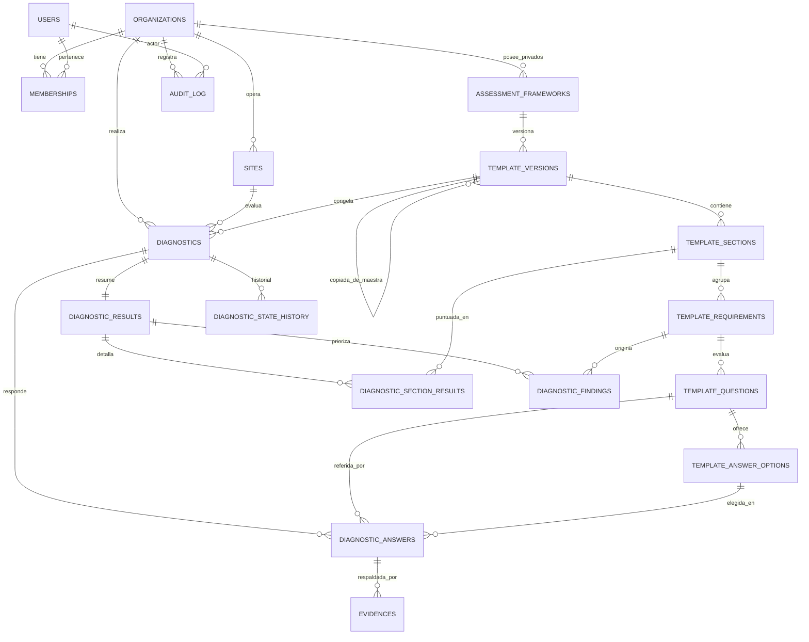
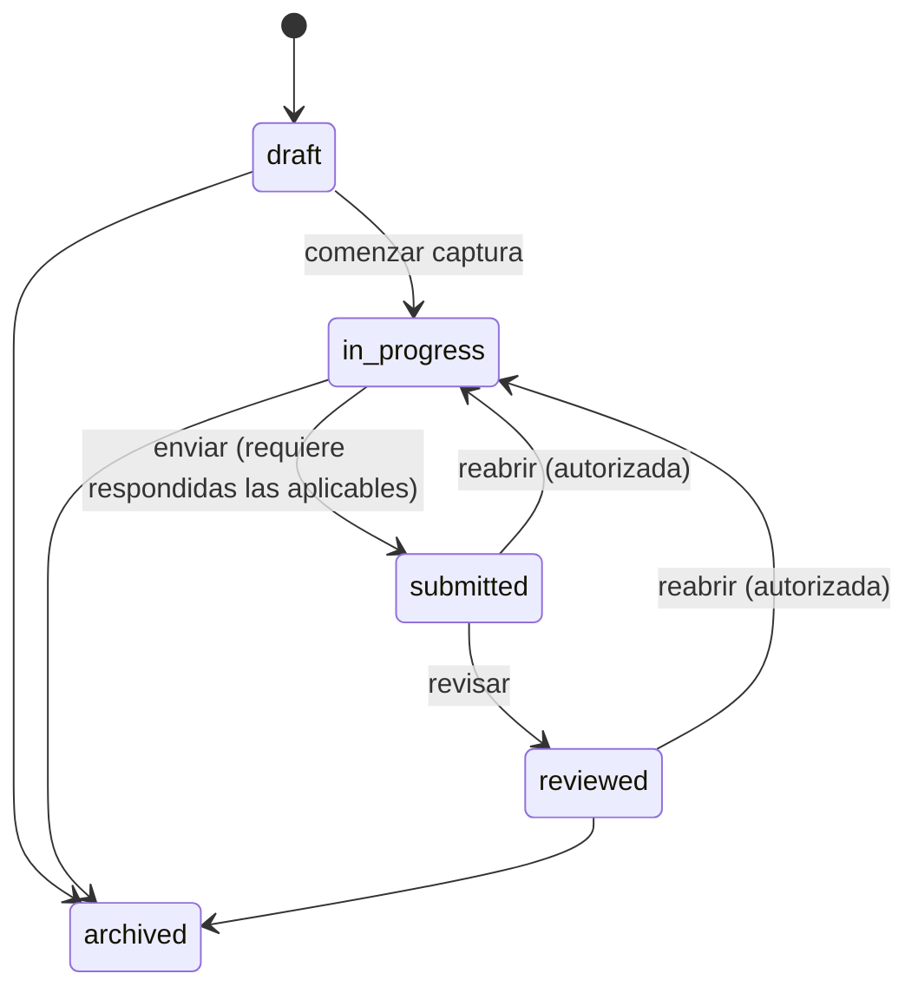

# TASK-002 — Propuesta de modelo de dominio del diagnóstico

> **Estado:** propuesta de diseño **con decisiones aprobadas incorporadas**
> (revisión posterior a la aprobación humana). Varias decisiones antes abiertas
> quedan **aprobadas**; el resto sigue **pendiente** (ver §16).
> **No** es una migración ni un cambio de esquema. No se ha modificado código de
> aplicación ni la base de datos. La implementación de TASK-002 solo inicia
> después de cerrar las decisiones pendientes (ver `docs/tasks/TASK-002.md`).
>
> **Nota importante:** las **reglas definitivas** de puntuación, criticidad y
> evidencias obligatorias quedan **fuera de este modelo** y se resolverán en una
> tarea específica del **motor de evaluación** (ver §16, D13). Los valores de
> riesgo, pesos y criticidad aquí descritos son **preliminares** y sirven para
> fijar la forma de los datos, no la regla de negocio final.

## 0. Alcance y encuadre

Este documento propone el **modelo de datos mínimo** para el Diagnóstico Digital
de GAPSI Sentinel, cubriendo: organizaciones, usuarios y membresías, sitios,
marcos de evaluación, versiones de plantilla, secciones, requisitos, preguntas,
opciones de respuesta, diagnósticos, respuestas, evidencias, resultados
calculados, historial de estados y auditoría básica.

Se apoya en decisiones **aprobadas** (ver §16 para el detalle y estado):

- **PostgreSQL** como base, monolito modular (ver `ARCHITECTURE_DECISIONS.md`).
  **[Aprobada]**
- **ORM: Prisma. [Aprobada]** El modelo se expresará en `schema.prisma`; donde
  Prisma no cubre una restricción (FK compuestas, RLS, triggers de
  inmutabilidad) se complementará con SQL de migración explícito.
- **Identificadores: UUID. [Aprobada]** Todas las PK son `uuid` (se recomienda la
  variante **v7** por orden temporal; la variante concreta no bloquea).
- **Multi-tenant de esquema compartido** con `organization_id` en cada tabla de
  negocio de tenant. **[Aprobada]** (Aislamiento reforzado en §8.)
- **Puntuación como módulo de dominio puro** que recibe una **versión congelada**
  de la plantilla + respuestas y devuelve numerador, denominador, porcentaje,
  resultados por sección, preguntas excluidas, críticos incumplidos, nivel de
  riesgo y brechas priorizadas.
- Reutiliza artefactos de TASK-001: `OrgRole` (`owner|admin|evaluator|viewer`),
  `OrganizationScoped`, `scopeToOrganization`, `assertOrganizationAccess`.

Convenciones aplicadas a **todas** las tablas de negocio salvo indicación:

- PK `id uuid` (UUID, se recomienda v7). **[Aprobada]**
- `organization_id uuid NOT NULL` (aislamiento de tenant, ver §8).
  **Excepción explícita:** el **catálogo maestro compartido** administrado por
  GAPSI (marcos y plantillas maestras, ver §5/§3.5/§3.6) lleva
  `organization_id NULL` y es de **solo lectura** para las organizaciones.
- `created_at timestamptz NOT NULL DEFAULT now()`, `updated_at timestamptz`.
- Borrado lógico con `deleted_at timestamptz NULL` donde aplique (ver §7).
- Los `enum` se muestran como conjuntos de valores; su representación física
  (enum nativo de PostgreSQL vs. `text + CHECK`) sigue **pendiente** (D5).

---

## 1. Diagrama de entidades y relaciones



Cadena de **trazabilidad** (ver §10):
`framework → template_version → section → requirement → question → answer_option`
y en ejecución `diagnostic → answer (question_id) → evidence (answer_id)` +
`result → section_result / finding (requirement_id, question_id)`.

---

## 2. Descripción de cada entidad

| Entidad                      | Propósito                                                                                                                                                   |
| ---------------------------- | ----------------------------------------------------------------------------------------------------------------------------------------------------------- |
| `organizations`              | Empresa cliente (tenant). Raíz de aislamiento.                                                                                                              |
| `users`                      | Identidad de persona. Espejo del proveedor de auth externo; **no** almacena contraseñas.                                                                    |
| `memberships`                | Relación usuario↔organización con un rol (`owner/admin/evaluator/viewer`).                                                                                 |
| `sites`                      | Planta, almacén, sucursal o instalación evaluada.                                                                                                           |
| `assessment_frameworks`      | Marco de evaluación (p. ej. HACCP). **Maestro** (compartido, administrado por GAPSI, `organization_id NULL`) o **privado** de una organización.             |
| `template_versions`          | **Copia inmutable** del cuestionario de un marco. Maestra (compartida) u **organización** (privada, posiblemente copiada de una maestra para personalizar). |
| `template_sections`          | Agrupación de requisitos dentro de una versión.                                                                                                             |
| `template_requirements`      | Condición evaluable; puede marcarse crítica.                                                                                                                |
| `template_questions`         | Pregunta con tipo, peso, criticidad y si admite "No aplica".                                                                                                |
| `template_answer_options`    | Opciones de respuesta con su fracción de cumplimiento.                                                                                                      |
| `diagnostics`                | Evaluación de una organización y sitio contra **una** `template_version` congelada.                                                                         |
| `diagnostic_answers`         | Respuesta a una pregunta dentro de un diagnóstico.                                                                                                          |
| `evidences`                  | Nota, referencia o archivo que respalda una respuesta, con estado de revisión.                                                                              |
| `diagnostic_results`         | Snapshot calculado (global) del cumplimiento y riesgo.                                                                                                      |
| `diagnostic_section_results` | Cumplimiento por sección dentro de un snapshot.                                                                                                             |
| `diagnostic_findings`        | Brechas priorizadas y hallazgos críticos derivados del cálculo.                                                                                             |
| `diagnostic_state_history`   | Bitácora de transiciones de estado del diagnóstico.                                                                                                         |
| `audit_log`                  | Registro append-only de acciones relevantes.                                                                                                                |

> Nota: el **seguimiento comercial** del brief (contacto, estado comercial,
> notas internas) se deja fuera de este modelo mínimo y se documenta como
> decisión abierta D10, para no exceder el alcance solicitado.

---

## 3–6. Campos, claves, restricciones e índices por entidad

Se listan campos principales, PK, FK, restricciones únicas e índices. Todos los
FK a **datos inmutables o referenciados** usan `ON DELETE RESTRICT` salvo que se
indique `CASCADE`.

### 3.1 `organizations`

| Campo      | Tipo        | Notas           |
| ---------- | ----------- | --------------- |
| id         | uuid        | **PK**          |
| name       | text        | NOT NULL        |
| slug       | citext      | único, opcional |
| created_at | timestamptz | NOT NULL        |
| updated_at | timestamptz |                 |
| deleted_at | timestamptz | borrado lógico  |

- **Único:** `slug`.
- **Índice:** `(slug)`.

### 3.2 `users`

| Campo        | Tipo        | Notas                                     |
| ------------ | ----------- | ----------------------------------------- |
| id           | uuid        | **PK**                                    |
| external_id  | text        | id del proveedor de auth; único; nullable |
| email        | citext      | NOT NULL, **único**                       |
| display_name | text        |                                           |
| created_at   | timestamptz | NOT NULL                                  |
| updated_at   | timestamptz |                                           |

- **Único:** `email`, `external_id`.
- `users` es global (una persona puede pertenecer a varias organizaciones vía
  `memberships`). **No** lleva `organization_id`.

### 3.3 `memberships`

| Campo           | Tipo         | Notas                          |
| --------------- | ------------ | ------------------------------ |
| id              | uuid         | **PK**                         |
| organization_id | uuid         | **FK** → organizations         |
| user_id         | uuid         | **FK** → users                 |
| role            | enum OrgRole | `owner/admin/evaluator/viewer` |
| status          | enum         | `active/invited/disabled`      |
| created_at      | timestamptz  | NOT NULL                       |

- **Único:** `(organization_id, user_id)`.
- **Índices:** `(user_id)`, `(organization_id, role)`.

### 3.4 `sites`

| Campo           | Tipo        | Notas                  |
| --------------- | ----------- | ---------------------- |
| id              | uuid        | **PK**                 |
| organization_id | uuid        | **FK** → organizations |
| code            | text        | opcional               |
| name            | text        | NOT NULL               |
| location        | text        | opcional               |
| created_at      | timestamptz | NOT NULL               |
| deleted_at      | timestamptz | borrado lógico         |

- **Único:** `(organization_id, code)` (parcial `WHERE code IS NOT NULL`),
  `(id, organization_id)` (para FK compuesta, ver §8).
- **Índice:** `(organization_id)`.

### 3.5 `assessment_frameworks`

| Campo           | Tipo        | Notas                                                                            |
| --------------- | ----------- | -------------------------------------------------------------------------------- |
| id              | uuid        | **PK**                                                                           |
| scope           | enum        | `master` / `organization`                                                        |
| organization_id | uuid        | **FK** → organizations. **NULL** si `scope='master'`; NOT NULL si `organization` |
| code            | text        | p. ej. `HACCP-INTERNAL`                                                          |
| name            | text        | NOT NULL                                                                         |
| description     | text        |                                                                                  |
| created_by      | uuid        | **FK** → users (admin de GAPSI para maestros)                                    |
| created_at      | timestamptz | NOT NULL                                                                         |
| deleted_at      | timestamptz | borrado lógico                                                                   |

- **Marcos maestros** (`scope='master'`): compartidos, administrados por GAPSI,
  de **solo lectura** para las organizaciones.
- **Marcos privados** (`scope='organization'`): pertenecen a una organización.
- **Único:** `(organization_id, code)` para privados; `(code)` parcial
  `WHERE scope='master'` para maestros; `(id, organization_id)` para FK compuesta
  (aplica solo a privados; ver §8).
- **CHECK:** `(scope='master' AND organization_id IS NULL) OR (scope='organization' AND organization_id IS NOT NULL)`.
- **Índice:** `(scope)`, `(organization_id)`.

### 3.6 `template_versions` (núcleo del versionado inmutable)

| Campo                    | Tipo        | Notas                                                 |
| ------------------------ | ----------- | ----------------------------------------------------- |
| id                       | uuid        | **PK**                                                |
| scope                    | enum        | `master` / `organization` (hereda del marco)          |
| organization_id          | uuid        | **FK** → organizations (espejo). **NULL** si `master` |
| framework_id             | uuid        | **FK** → assessment_frameworks                        |
| source_master_version_id | uuid        | **FK** → template_versions (maestra origen), NULL     |
| version_number           | int         | NOT NULL                                              |
| status                   | enum        | `draft/published/archived`                            |
| content_hash             | text        | hash del contenido congelado (integridad)             |
| published_at             | timestamptz | NULL hasta publicar                                   |
| created_by               | uuid        | **FK** → users                                        |
| created_at               | timestamptz | NOT NULL                                              |

- **Único:** `(framework_id, version_number)`; `(id, organization_id)` para las de
  organización (FK compuesta, §8).
- **Índice:** `(scope)`, `(organization_id, framework_id, status)`.
- **Copia maestra → privada:** copiar una plantilla maestra crea una nueva
  `template_version` con `scope='organization'`, `organization_id` de la
  organización y `source_master_version_id` apuntando a la maestra; a partir de
  ahí se puede **personalizar** en `draft` y publicar. Ver §5-bis.
- **Regla de inmutabilidad:** al pasar a `published`, esta fila y **todas** sus
  filas hijas (secciones, requisitos, preguntas, opciones) quedan de solo
  lectura (ver §9 y §13).

### 3.7 `template_sections`

| Campo               | Tipo    | Notas                      |
| ------------------- | ------- | -------------------------- |
| id                  | uuid    | **PK**                     |
| organization_id     | uuid    | espejo                     |
| template_version_id | uuid    | **FK** → template_versions |
| code                | text    | trazabilidad (p. ej. `S1`) |
| title               | text    | NOT NULL                   |
| position            | int     | orden                      |
| weight              | numeric | opcional (ver D7)          |

- **Único:** `(template_version_id, code)`, `(id, organization_id)`.
- **Índice:** `(template_version_id, position)`.

### 3.8 `template_requirements`

| Campo               | Tipo    | Notas                        |
| ------------------- | ------- | ---------------------------- |
| id                  | uuid    | **PK**                       |
| organization_id     | uuid    | espejo                       |
| template_version_id | uuid    | **FK** → template_versions   |
| section_id          | uuid    | **FK** → template_sections   |
| code                | text    | trazabilidad (p. ej. `R1.2`) |
| title               | text    | NOT NULL                     |
| description         | text    |                              |
| is_critical         | boolean | NOT NULL DEFAULT false       |
| position            | int     | orden                        |

- **Único:** `(template_version_id, code)`.
- **Índice:** `(section_id, position)`.

### 3.9 `template_questions`

| Campo                 | Tipo    | Notas                                                               |
| --------------------- | ------- | ------------------------------------------------------------------- |
| id                    | uuid    | **PK**                                                              |
| organization_id       | uuid    | espejo                                                              |
| template_version_id   | uuid    | **FK** → template_versions                                          |
| requirement_id        | uuid    | **FK** → template_requirements                                      |
| code                  | text    | trazabilidad                                                        |
| prompt                | text    | NOT NULL                                                            |
| question_type         | enum    | `yes_no / single_choice / text`                                     |
| weight                | numeric | NOT NULL DEFAULT 1 (peso)                                           |
| is_critical           | boolean | NOT NULL DEFAULT false                                              |
| allows_not_applicable | boolean | NOT NULL DEFAULT false                                              |
| is_scored             | boolean | NOT NULL. Por defecto **false** para `text`, **true** para el resto |
| position              | int     | orden                                                               |

- **Único:** `(template_version_id, code)`.
- **Índice:** `(requirement_id, position)`.
- El tipo `not_applicable` del brief se modela como **atributo**
  (`allows_not_applicable`), no como tipo de pregunta (ver §11 y supuesto A3).
- **Preguntas de texto (decisión aprobada):** por defecto **no puntúan**
  (`is_scored=false`); sirven para **observaciones, justificaciones y
  comentarios**. Solo puntúan si se define una **regla explícita** en la
  plantilla (`is_scored=true` + la regla de puntuación de texto). Esa regla es
  parte del **motor de evaluación** (D13) y no se especifica aquí.

### 3.10 `template_answer_options`

| Campo               | Tipo         | Notas                                    |
| ------------------- | ------------ | ---------------------------------------- |
| id                  | uuid         | **PK**                                   |
| organization_id     | uuid         | espejo                                   |
| template_version_id | uuid         | **FK** → template_versions               |
| question_id         | uuid         | **FK** → template_questions              |
| code                | text         | trazabilidad                             |
| label               | text         | p. ej. `Sí`, `No`, `Cumple parcialmente` |
| score_fraction      | numeric(4,3) | NOT NULL, `CHECK 0 <= x <= 1`            |
| position            | int          | orden                                    |

- **Único:** `(question_id, code)`.
- Para `yes_no` se siembran dos opciones (`Sí=1`, `No=0`, configurable). Los
  `text` no llevan opciones.

### 3.11 `diagnostics`

| Campo               | Tipo        | Notas                                           |
| ------------------- | ----------- | ----------------------------------------------- |
| id                  | uuid        | **PK**                                          |
| organization_id     | uuid        | **FK** → organizations                          |
| site_id             | uuid        | **FK** → sites (compuesta, §8)                  |
| template_version_id | uuid        | **FK** → template_versions (**RESTRICT**)       |
| name                | text        | NOT NULL                                        |
| responsible_user_id | uuid        | **FK** → users                                  |
| target_date         | date        | fecha objetivo                                  |
| status              | enum        | `draft/in_progress/submitted/reviewed/archived` |
| created_by          | uuid        | **FK** → users                                  |
| submitted_by        | uuid        | **FK** → users, NULL                            |
| submitted_at        | timestamptz | NULL                                            |
| reviewed_by         | uuid        | **FK** → users, NULL                            |
| reviewed_at         | timestamptz | NULL                                            |
| created_at          | timestamptz | NOT NULL                                        |
| updated_at          | timestamptz |                                                 |

- **Único:** `(id, organization_id)`.
- **Índices:** `(organization_id, status)`, `(organization_id, site_id)`,
  `(template_version_id)`.

### 3.12 `diagnostic_answers`

| Campo              | Tipo        | Notas                                                |
| ------------------ | ----------- | ---------------------------------------------------- |
| id                 | uuid        | **PK**                                               |
| organization_id    | uuid        | espejo                                               |
| diagnostic_id      | uuid        | **FK** → diagnostics (**CASCADE** en borrado lógico) |
| question_id        | uuid        | **FK** → template_questions                          |
| answer_status      | enum        | `pending/answered/not_applicable`                    |
| selected_option_id | uuid        | **FK** → template_answer_options, NULL               |
| value_text         | text        | para `text`, NULL                                    |
| na_justification   | text        | requerida si `not_applicable`                        |
| answered_by        | uuid        | **FK** → users, NULL                                 |
| answered_at        | timestamptz | NULL                                                 |
| created_at         | timestamptz | NOT NULL                                             |
| updated_at         | timestamptz |                                                      |

- **Único:** `(diagnostic_id, question_id)` — una respuesta por pregunta.
- **Índice:** `(diagnostic_id)`.
- **Consistencia (CHECK + app):** `selected_option_id` solo para
  `yes_no/single_choice`; `value_text` solo para `text`; ambos NULL cuando
  `not_applicable`. La pregunta debe pertenecer a la **misma** `template_version`
  que el diagnóstico (ver §15, riesgo de consistencia; FK compuesta recomendada).

### 3.13 `evidences`

| Campo           | Tipo        | Notas                                             |
| --------------- | ----------- | ------------------------------------------------- |
| id              | uuid        | **PK**                                            |
| organization_id | uuid        | espejo                                            |
| diagnostic_id   | uuid        | **FK** → diagnostics                              |
| answer_id       | uuid        | **FK** → diagnostic_answers                       |
| kind            | enum        | `note/reference/file`                             |
| note_text       | text        | para `note`                                       |
| reference_url   | text        | para `reference` (sin datos personales en la URL) |
| storage_backend | enum        | `local/simulated/private` (según ambiente)        |
| file_object_key | text        | clave de almacenamiento privado, NULL             |
| status          | enum        | `not_provided/provided/accepted/rejected`         |
| created_by      | uuid        | **FK** → users                                    |
| reviewed_by     | uuid        | **FK** → users, NULL                              |
| reviewed_at     | timestamptz | NULL                                              |
| created_at      | timestamptz | NOT NULL                                          |
| deleted_at      | timestamptz | borrado lógico                                    |

- **Índices:** `(diagnostic_id)`, `(answer_id)`.
- **Almacenamiento de evidencias (decisión aprobada):**
  - **Desarrollo:** almacenamiento **local o simulado** (`storage_backend`
    `local`/`simulated`); no requiere servicios de pago.
  - **Producción:** almacenamiento **privado** con **URLs temporales (firmadas)**
    (`storage_backend='private'`); sin datos personales en `reference_url`.
  - El **proveedor definitivo** de almacenamiento sigue **pendiente** (D9); el
    acceso se abstrae tras una interfaz de almacenamiento para no acoplar el
    dominio (mismo principio que el adaptador de auth de TASK-001).

### 3.14 `diagnostic_results` (snapshot global)

| Campo              | Tipo         | Notas                                           |
| ------------------ | ------------ | ----------------------------------------------- |
| id                 | uuid         | **PK**                                          |
| organization_id    | uuid         | espejo                                          |
| diagnostic_id      | uuid         | **FK** → diagnostics                            |
| numerator          | numeric      | Σ peso·fracción (incluidas)                     |
| denominator        | numeric      | Σ peso (incluidas y aplicables)                 |
| percentage         | numeric(5,2) | 0–100                                           |
| risk_level         | enum         | `low/moderate/high/critical` (umbrales en §12)  |
| critical_unmet     | int          | nº de requisitos/preguntas críticas incumplidas |
| excluded_count     | int          | preguntas excluidas (N/A + no puntuables)       |
| engine_version     | text         | versión del algoritmo de puntuación             |
| inputs_hash        | text         | hash de (template_version + respuestas)         |
| computed_at        | timestamptz  | NOT NULL                                        |
| computed_by        | uuid         | **FK** → users, NULL (NULL = sistema)           |
| invalidated_at     | timestamptz  | NULL. Se fija al **reabrir** el diagnóstico     |
| invalidated_by     | uuid         | **FK** → users, NULL                            |
| invalidated_reason | text         | motivo de la invalidación (reapertura)          |

- **Único (parcial):** `(diagnostic_id) WHERE invalidated_at IS NULL` — a lo sumo
  **un** resultado vigente por diagnóstico. Los resultados invalidados por
  reapertura se conservan para auditoría (ver §Estados y §9-reapertura).
- El cálculo es determinista; recalcular produce un nuevo resultado vigente.

### 3.15 `diagnostic_section_results`

| Campo                | Tipo         | Notas                                 |
| -------------------- | ------------ | ------------------------------------- |
| id                   | uuid         | **PK**                                |
| organization_id      | uuid         | espejo                                |
| diagnostic_result_id | uuid         | **FK** → diagnostic_results (CASCADE) |
| section_id           | uuid         | **FK** → template_sections            |
| numerator            | numeric      |                                       |
| denominator          | numeric      |                                       |
| percentage           | numeric(5,2) |                                       |
| excluded_count       | int          |                                       |

- **Único:** `(diagnostic_result_id, section_id)`.

### 3.16 `diagnostic_findings` (brechas priorizadas / críticos)

| Campo                | Tipo    | Notas                                   |
| -------------------- | ------- | --------------------------------------- |
| id                   | uuid    | **PK**                                  |
| organization_id      | uuid    | espejo                                  |
| diagnostic_result_id | uuid    | **FK** → diagnostic_results (CASCADE)   |
| requirement_id       | uuid    | **FK** → template_requirements          |
| question_id          | uuid    | **FK** → template_questions, NULL       |
| is_critical          | boolean | hallazgo crítico                        |
| gap_score            | numeric | peso·(1−fracción); base de priorización |
| rank                 | int     | orden de prioridad                      |

- **Índice:** `(diagnostic_result_id, rank)`.

### 3.17 `diagnostic_state_history`

| Campo           | Tipo        | Notas                          |
| --------------- | ----------- | ------------------------------ |
| id              | uuid        | **PK**                         |
| organization_id | uuid        | espejo                         |
| diagnostic_id   | uuid        | **FK** → diagnostics (CASCADE) |
| from_status     | enum        | NULL en la creación            |
| to_status       | enum        | NOT NULL                       |
| changed_by      | uuid        | **FK** → users                 |
| changed_at      | timestamptz | NOT NULL DEFAULT now()         |
| note            | text        | opcional                       |

- **Índice:** `(diagnostic_id, changed_at)`.

### 3.18 `audit_log` (append-only)

| Campo           | Tipo        | Notas                                                |
| --------------- | ----------- | ---------------------------------------------------- |
| id              | bigint      | **PK** (secuencia; orden temporal estable)           |
| organization_id | uuid        | **FK** → organizations                               |
| actor_user_id   | uuid        | **FK** → users, NULL (NULL = sistema)                |
| action          | text        | p. ej. `diagnostic.status_changed`, `answer.updated` |
| entity_type     | text        | p. ej. `diagnostic`, `evidence`                      |
| entity_id       | uuid        |                                                      |
| metadata        | jsonb       | resumen/diff **sin** datos sensibles crudos          |
| created_at      | timestamptz | NOT NULL DEFAULT now()                               |

- **Índices:** `(organization_id, created_at)`, `(entity_type, entity_id)`.
- **Solo inserción**: sin `UPDATE`/`DELETE` (ver §7).

---

## 5-bis. Marcos maestros, plantillas privadas y personalización por copia (aprobado)

Decisión aprobada sobre marcos de evaluación:

- **Marcos y plantillas maestras**: catálogo **compartido administrado por
  GAPSI**, `scope='master'`, `organization_id NULL`, **solo lectura** para las
  organizaciones. Es contenido de plataforma, no dato de tenant.
- **Plantillas privadas por organización**: `scope='organization'`,
  `organization_id` de la organización.
- **Copia para personalizar**: una organización puede **copiar** una plantilla
  maestra publicada; se genera una `template_version` privada (`scope='organization'`)
  con `source_master_version_id` a la maestra. Esa copia es editable en `draft`,
  se personaliza y se publica como versión inmutable de la organización.

**Regla de uso en diagnósticos (clave para el aislamiento):** un `diagnostic`
siempre referencia una **`template_version` de la organización** (nunca una
maestra directamente). "Usar" una plantilla maestra implica primero **copiarla**
(adopción, con o sin cambios) al espacio de la organización. Así:

- se preserva la **FK compuesta anti-cruce** `(template_version_id, organization_id)`
  (ver §8), porque la versión referida siempre tiene el `organization_id` del
  diagnóstico;
- el catálogo maestro puede evolucionar sin afectar diagnósticos ya ejecutados
  (cada uno quedó sellado a su copia privada e inmutable);
- las políticas RLS del tenant no necesitan exponer filas de otras
  organizaciones; el catálogo maestro se expone por una política de solo lectura
  aparte.

---

## 7. Reglas de borrado y conservación

- **Preferir borrado lógico** (`deleted_at`) sobre borrado físico en datos de
  negocio; nunca borrar en cascada datos con valor de auditoría.
- **Datos inmutables referenciados** (`template_versions` y sus hijos) usados por
  algún diagnóstico: `ON DELETE RESTRICT`. No se borran; se **archivan**
  (`status='archived'`).
- **Diagnósticos**: no se borran físicamente en el MVP; se archivan. Sus hijos
  (`diagnostic_answers`, `evidences`, `*_results`, `state_history`) siguen al
  diagnóstico; el borrado lógico del padre oculta el árbol sin destruirlo.
- **Evidencias tipo archivo**: el objeto en almacenamiento se elimina mediante un
  proceso de ciclo de vida separado (diferido, D9); el registro conserva la
  traza de que existió.
- **`audit_log` y `diagnostic_state_history`**: append-only, conservación
  indefinida en el MVP (retención configurable más adelante).
- **Organización**: borrado solo por proceso administrativo explícito (fuera de
  alcance); por defecto `RESTRICT`. La auditoría se conserva.
- **Catálogo maestro (GAPSI)**: marcos y plantillas maestras no se borran si
  alguna copia privada los referencia (`source_master_version_id`); se
  **archivan**. Las copias privadas siguen las reglas del tenant.
- Toda operación destructiva exige respaldo previo (ver `CODEX_WORKFLOW.md`).

---

## 8. Estrategia de aislamiento por `organization_id`

Defensa en profundidad, en tres capas:

1. **Columna en cada tabla de negocio.** `organization_id` se **denormaliza** en
   todas las tablas hijas (no solo en la raíz) para permitir filtros e índices
   compuestos directos y políticas RLS por fila.
2. **Capa de acceso a datos con scope.** Toda consulta se filtra por
   `session.organizationId`, reutilizando `scopeToOrganization` y
   `assertOrganizationAccess` de TASK-001. **Nunca** se confía en un
   `organization_id` provisto por el cliente para el recurso.
3. **Defensa en base de datos (aprobada, D3):** **Row-Level Security (RLS)**
   de PostgreSQL con políticas basadas en una variable de sesión
   (`SET app.current_org = …`) fijada por conexión/transacción.

**FK compuestas anti-cruce (clave):** para impedir físicamente que un hijo
referencie un padre de otra organización, se define `UNIQUE(id, organization_id)`
en los padres y FK compuestas en los hijos:
`FOREIGN KEY (site_id, organization_id) REFERENCES sites(id, organization_id)`.
Así el motor rechaza cualquier referencia cruzada, incluso si la capa de app
fallara.

- **Índices** encabezados por `organization_id` donde haya filtro por tenant.
- **Pruebas negativas** obligatorias entre dos organizaciones (per
  `ARCHITECTURE_DECISIONS.md`).
- **Excepción del catálogo maestro (§5-bis):** los marcos y plantillas maestras
  (`scope='master'`, `organization_id NULL`) son **contenido de plataforma de
  solo lectura**. Se exponen con una **política RLS de lectura** independiente
  (visible para todas las organizaciones, escritura reservada a GAPSI) y **no**
  participan en las FK compuestas por tenant; los diagnósticos solo referencian
  plantillas **de la organización** (copias), preservando el anti-cruce.

---

## 9. Estrategia de versionado inmutable de plantillas

- La **edición** ocurre sobre una `template_version` en estado `draft`.
- Al **publicar** (`published`), se congela: la versión y todas sus filas hijas
  pasan a solo lectura. Se sugiere reforzar con un **trigger** que rechace
  `UPDATE/DELETE` sobre filas cuya versión no esté en `draft`.
- Un **cambio** al cuestionario **no** modifica la versión publicada: crea una
  **nueva** `template_version` (`version_number + 1`).
- `content_hash` sella el contenido; los diagnósticos guardan
  `template_version_id` (RESTRICT) y los resultados guardan `inputs_hash` +
  `engine_version` para reproducibilidad.

---

## 10. Trazabilidad requisito → pregunta → respuesta → evidencia → puntuación

Cada nivel conserva el `*_id` congelado del nivel superior, de modo que la cadena
completa se reconstruye por JOINs:

```
framework ─ template_version ─ section ─ requirement ─ question ─ answer_option
                                                         │
                              diagnostic ─ diagnostic_answer (question_id)
                                                         │
                                              evidence (answer_id)
                                                         │
        diagnostic_result ─ section_result (section_id) + finding (requirement_id, question_id)
```

Como la `template_version` es inmutable, los `question_id`/`requirement_id`
referidos por respuestas, evidencias y hallazgos **siempre** resuelven al texto y
peso vigentes cuando se ejecutó el diagnóstico.

---

## 11. Manejo de respuestas "No aplica"

- La plantilla decide por pregunta con `allows_not_applicable`.
- La respuesta registra `answer_status='not_applicable'` + `na_justification`
  **obligatoria** (glosario: "respuesta justificada").
- El motor **excluye** la pregunta del **denominador** solo si la plantilla lo
  permite; si no lo permite, `not_applicable` es inválida (se valida en servidor).
- El conteo de exclusiones se refleja en `diagnostic_results.excluded_count` y
  `diagnostic_section_results.excluded_count`.
- Comportamiento determinista y cubierto por pruebas.

---

## 12. Representación de preguntas críticas y riesgo preliminar (aprobado)

- `template_questions.is_critical` (y `template_requirements.is_critical` a nivel
  agregado).
- Una pregunta/requisito crítico **incumplido** genera un `diagnostic_finding`
  con `is_critical=true` y **eleva** `risk_level` **independientemente del
  promedio** (glosario: "eleva el riesgo sin depender únicamente del promedio").

**Escala de riesgo preliminar aprobada** (sobre el `percentage` global):

| Cumplimiento   | Sin críticos incumplidos  | Con ≥1 crítico incumplido |
| -------------- | ------------------------- | ------------------------- |
| 90 % – 100 %   | **Bajo** (`low`)          | **Alto** como mínimo      |
| 75 % – 89.99 % | **Moderado** (`moderate`) | **Alto** como mínimo      |
| 50 % – 74.99 % | **Alto** (`high`)         | **Alto** (o superior)     |
| < 50 %         | **Crítico** (`critical`)  | **Crítico**               |

- Regla transversal: **cualquier requisito crítico incumplido eleva el riesgo a
  `high` como mínimo** (y no lo baja si ya era `critical`).
- Valores del enum: `low / moderate / high / critical`.
- **Preliminar:** esta escala fija la forma del dato; las **reglas definitivas**
  de puntuación y criticidad se cierran en la tarea del **motor de evaluación**
  (§16, D13).

---

## 13. Evitar que cambios futuros alteren diagnósticos anteriores

Combinación de §9 + §10:

1. Versiones publicadas inmutables (app + trigger).
2. Los cambios crean una versión nueva, nunca mutan la usada.
3. `diagnostics.template_version_id` con `ON DELETE RESTRICT`.
4. Resultados con `engine_version` + `inputs_hash` → recomputables e idénticos.

Un diagnóstico histórico queda "sellado" a su versión y a la versión del motor de
puntuación.

---

## 14. Registro de quién creó, respondió, envió, revisó o modificó

- **Columnas de actor:** `diagnostics.created_by/submitted_by/reviewed_by`,
  `diagnostic_answers.answered_by`, `evidences.created_by/reviewed_by`.
- **`diagnostic_state_history`:** un registro por transición
  (`from_status→to_status`, `changed_by`, `changed_at`).
- **`audit_log`:** append-only para creación y cambio de estado del diagnóstico,
  modificación de respuestas, carga/eliminación de evidencias, envío y revisión,
  y cambios de roles (cobertura mínima de `ARCHITECTURE_DECISIONS.md`).

---

## 15. Riesgos de seguridad, consistencia y pérdida de datos

**Seguridad**

- _Fuga entre organizaciones_ si una consulta omite el filtro → mitigado por FK
  compuestas + RLS + capa con scope + pruebas negativas (§8).
- _Privacidad de evidencias_: en producción, almacenamiento **privado** con URLs
  **temporales**; en desarrollo, local o simulado; sin datos personales en
  `reference_url`. Proveedor definitivo pendiente (D9).
- _Autenticación aún simulada_ (stub `dev` de TASK-001): **debe** sustituirse por
  un proveedor real antes de manejar datos reales.
- _Abuso de "No aplica"_ para inflar cumplimiento → exige justificación y control
  por plantilla; auditable.

**Consistencia**

- _Respuesta de una versión distinta_ a la del diagnóstico → prohibido por
  validación y FK compuesta `(diagnostic_id, question_id)` acotada a la versión.
- _Respuesta incoherente con el tipo de pregunta_ → CHECK + validación en
  servidor.
- _Carrera al recalcular resultados_ → cálculo en transacción única, snapshot con
  `inputs_hash`; el motor puro es determinista.

**Pérdida de datos**

- _Borrado físico accidental_ → borrado lógico + `RESTRICT` en referencias
  inmutables; `audit_log`/`state_history` append-only.
- _Mutación de una versión publicada_ → triggers de inmutabilidad.
- _Operaciones destructivas_ → respaldo previo y rollback documentado.

---

## 16. Decisiones: estado (aprobadas / pendientes)

| ID  | Decisión                                                                                         | Estado                             | Resolución / nota                                                                                           |
| --- | ------------------------------------------------------------------------------------------------ | ---------------------------------- | ----------------------------------------------------------------------------------------------------------- |
| D1  | ORM                                                                                              | **Aprobada**                       | **Prisma** (+ SQL explícito para FK compuestas, RLS y triggers).                                            |
| D2  | Tipo de PK                                                                                       | **Aprobada**                       | **UUID** (se recomienda v7).                                                                                |
| D3  | Aislamiento en base de datos                                                                     | **Aprobada**                       | `organization_id` obligatorio + filtros en app + **FK compuestas anti-cruce** + **RLS**.                    |
| D4  | Marcos de evaluación                                                                             | **Aprobada**                       | **Maestros compartidos (GAPSI)** + **privados por organización** + **copia** de maestra para personalizar.  |
| D5  | Representación física de enums (nativo vs. `text+CHECK`)                                         | **Pendiente**                      | Recomendación: `text + CHECK`. A confirmar en implementación.                                               |
| D6  | Escala de `risk_level` y regla de crítico                                                        | **Aprobada (preliminar)**          | Escala de §12; **reglas definitivas** en D13.                                                               |
| D7  | Pesos por sección además de por pregunta                                                         | **Pendiente**                      | Se resolverá con el motor de evaluación (D13). MVP: solo peso por pregunta.                                 |
| D8  | Puntuación de preguntas `text`                                                                   | **Aprobada**                       | **No puntúan por defecto**; observaciones/justificaciones; solo puntúan por **regla explícita**.            |
| D9  | Almacenamiento de evidencias                                                                     | **Aprobada (proveedor pendiente)** | Dev: local/simulado. Prod: privado + **URLs temporales**. **Proveedor definitivo pendiente**.               |
| D10 | Seguimiento comercial (contacto, estado, notas)                                                  | **Pendiente**                      | Fase posterior; fuera de este modelo mínimo.                                                                |
| D11 | Reapertura de diagnósticos                                                                       | **Aprobada**                       | Autorizada; registra usuario/fecha/motivo; **invalida el resultado vigente**; exige nuevo envío y revisión. |
| D12 | Sitios por diagnóstico                                                                           | **Aprobada**                       | **Un** sitio/planta por diagnóstico en el MVP.                                                              |
| D13 | **Reglas definitivas del motor de evaluación** (puntuación, criticidad, evidencias obligatorias) | **Pendiente**                      | **Tarea específica del motor de evaluación.** Este documento fija solo la **forma** de los datos.           |

**Pendientes por cerrar antes/junto a la implementación:** D5 (enums), D7 (pesos
por sección), D9 (proveedor de almacenamiento), D10 (comercial) y, sobre todo,
**D13 (reglas definitivas del motor de evaluación)**.

---

## Ejemplo simplificado de un diagnóstico completo

**Plantilla** (marco `HACCP-INTERNAL`, `template_version` v1, publicada):

- Sección `S1` "Control de peligros"
  - Requisito `R1` "PCC monitoreado" (**crítico**)
    - `Q1` (yes_no, peso 1, **crítica**): "¿Existe monitoreo de cada PCC?"
      → opciones `Sí=1`, `No=0`
    - `Q2` (single_choice, peso 2): "¿Frecuencia de verificación?"
      → `Adecuada=1`, `Parcial=0.5`, `Inexistente=0`
    - `Q3` (text, `is_scored=false`): "Describa el método" (informativa)
    - `Q4` (yes_no, peso 1, `allows_not_applicable=true`): "¿Aplica plan de
      alérgenos?" → opciones `Sí=1`, `No=0`

**Diagnóstico** (sitio "Planta Norte", `template_version=v1`, estado
`in_progress`):

| Pregunta | Respuesta           | Fracción | Incluida             |
| -------- | ------------------- | -------- | -------------------- |
| Q1       | `Sí`                | 1.0      | sí (crítica, cumple) |
| Q2       | `Parcial`           | 0.5      | sí                   |
| Q3       | texto libre         | —        | no (no puntuable)    |
| Q4       | `No aplica` (just.) | —        | no (excluida N/A)    |

**Cálculo determinista:**

```
numerador   = 1·1.0 + 2·0.5            = 2.0
denominador = 1     + 2                = 3.0
porcentaje  = 2.0 / 3.0                = 66.67 %
excluidas   = 2 (Q3 no puntuable, Q4 N/A)
críticos incumplidos = 0 (Q1 crítica cumplió)
risk_level  = "high" (Alto)   # 50–74.99 % sin críticos incumplidos
```

Si `Q1` hubiera sido `No` (0.0): se genera `diagnostic_finding` crítico y, por la
regla transversal, `risk_level` se eleva a **`high` como mínimo**
**independientemente** del 66.67 % (§12).

---

## Estados y transiciones del diagnóstico

Estados (del Product Brief): `draft`, `in_progress`, `submitted`, `reviewed`,
`archived`.



- **Guardas:** `submitted` exige que toda pregunta aplicable y no-N/A esté
  respondida. `reviewed` fija `reviewed_by/reviewed_at`.
- **Efectos:** cada transición escribe `diagnostic_state_history` + `audit_log`.
  Los `diagnostic_results` se calculan al `submitted` (y pueden recalcularse al
  `reviewed`).

**Reapertura (decisión aprobada).** Volver de `submitted`/`reviewed` a
`in_progress`:

- **requiere autorización** (rol con permiso; se valida en servidor);
- **registra usuario, fecha y motivo** en `diagnostic_state_history`
  (`changed_by`, `changed_at`, `note`=motivo) y en `audit_log`
  (`action='diagnostic.reopened'`);
- **invalida el resultado vigente**: fija `diagnostic_results.invalidated_at /
invalidated_by / invalidated_reason` (el snapshot se conserva para auditoría);
- **exige un nuevo envío y una nueva revisión** para volver a tener un resultado
  vigente.

---

## Supuestos

- **A1.** El proveedor de auth real aún no existe; `users.external_id` mapeará al
  proveedor cuando se decida (TASK-001 dejó el adaptador desacoplado).
- **A2.** Un diagnóstico evalúa **un** sitio y **una** `template_version`
  (D12 aprobada).
- **A3.** "No aplica" es un **estado de respuesta**, no un tipo de pregunta; los
  tipos son `yes_no/single_choice/text` (interpretación del brief).
- **A4.** Las preguntas `text` no puntúan por defecto; sirven para observaciones
  y justificaciones, y solo puntúan por regla explícita (D8 aprobada).
- **A5.** La fracción de cumplimiento por opción vive en `[0,1]`; el peso vive en
  la pregunta.
- **A6.** La escala de riesgo de §12 es **preliminar (aprobada)**; las reglas
  definitivas de puntuación, criticidad y evidencias obligatorias se cierran en
  la tarea del motor de evaluación (D13, pendiente).
- **A7.** El almacenamiento de archivos de evidencia se difiere; el modelo ya deja
  el campo `file_object_key`.

---

## Alternativas descartadas y por qué

| Alternativa                                                        | Motivo del descarte                                                                                                                              |
| ------------------------------------------------------------------ | ------------------------------------------------------------------------------------------------------------------------------------------------ |
| **EAV / cuestionario genérico** (atributo-valor)                   | Integridad débil, difícil de indexar y de trazar; contradice la trazabilidad exigida                                                             |
| **Plantillas mutables** con versión por fila / _soft-versioning_   | Rompe la reproducibilidad; complica sellar diagnósticos históricos                                                                               |
| **Cuestionario y respuestas como un único JSONB**                  | Pierde integridad referencial, restricciones y consultas por sección/requisito                                                                   |
| **Schema-per-tenant / base por organización**                      | `ARCHITECTURE_DECISIONS.md` fija esquema compartido con `organization_id`                                                                        |
| **Copiar el texto de la pregunta dentro de cada respuesta**        | Redundante; la inmutabilidad de la versión ya garantiza estabilidad                                                                              |
| **Solo cálculo al vuelo, sin snapshot de resultados**              | Reportes no reproducibles y más costosos; se prefiere snapshot recomputable                                                                      |
| **Borrado físico con `CASCADE`**                                   | Riesgo de pérdida de datos y de auditoría; se elige borrado lógico + `RESTRICT`                                                                  |
| **Diagnóstico directo sobre una plantilla maestra (sin copiarla)** | Rompería la FK compuesta anti-cruce (org ≠ NULL), acoplaría diagnósticos a cambios del catálogo y complicaría RLS; se prefiere **copia al usar** |

---

## Recomendación final de modelo

Adoptar el **modelo relacional explícito** aquí descrito, sobre **PostgreSQL** con
**Prisma** y **PK UUID**: esquema compartido multi-tenant con `organization_id`
obligatorio (con la excepción del **catálogo maestro compartido**), **FK
compuestas anti-cruce** + **RLS** + filtros en app, \*\*marcos maestros compartidos

- plantillas privadas por organización con copia para personalizar**, **versiones
  de plantilla inmutables** (nueva versión por cambio), **respuestas y evidencias
  ligadas a la pregunta congelada**, **evidencias con almacenamiento local/simulado
  en desarrollo y privado con URLs temporales en producción**, **reapertura
  autorizada que invalida el resultado vigente**, y **resultados como snapshot
  determinista y recomputable\*\* (`engine_version` + `inputs_hash`). Este modelo
  satisface trazabilidad, aislamiento, reproducibilidad y auditoría con la mínima
  complejidad, y deja la puntuación como módulo de dominio puro.

**Antes de implementar TASK-002 quedan por cerrar las decisiones pendientes,
en particular D13 (reglas definitivas del motor de evaluación), además de D5
(enums), D7 (pesos por sección), D9 (proveedor de almacenamiento) y D10
(seguimiento comercial). Las reglas definitivas de puntuación, criticidad y
evidencias obligatorias NO se implementan en TASK-002: corresponden a la tarea
del motor de evaluación.**

_Este documento es una propuesta de diseño. No modifica código de aplicación, no
crea migraciones y no altera el esquema de base de datos._
