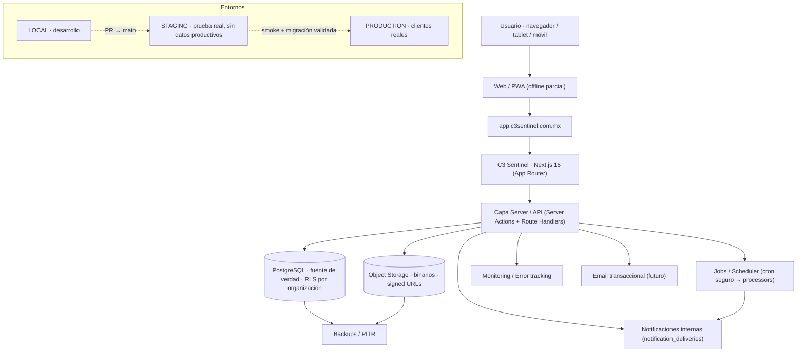

# C3 Sentinel — Arquitectura de producción (PLATFORM-001)

> Fase de **diseño**. No despliega producción, no contrata servicios, no migra datos.
> Audita el repo real, define la arquitectura objetivo y prepara contratos.

## 1. Principios de producto (decididos)

SaaS **multi-tenant**, **web-first**, **PWA-ready**, tablet/móvil, conectividad
intermitente (offline parcial futuro). **PostgreSQL** = datos estructurados;
**Object Storage** = binarios. Aislamiento por organización, trazabilidad completa,
una sola base de código para múltiples clientes. **Tasks** como motor operativo
transversal. Políticas visuales/funcionales centralizadas por organización.

## 2. Arquitectura ACTUAL (auditada)

| Capa              | Estado real                                                                                                                                                                                                                                                                                                                                                                                                                                                                                       |
| ----------------- | ------------------------------------------------------------------------------------------------------------------------------------------------------------------------------------------------------------------------------------------------------------------------------------------------------------------------------------------------------------------------------------------------------------------------------------------------------------------------------------------------- |
| **App**           | Next.js **15.5.22** (App Router, `src/app`), React **19**, TypeScript **5.7.3** strict (`noUncheckedIndexedAccess`), Node ≥20. Server Components + **Server Actions** (`actions.ts` por módulo) + Route Handlers mínimos (1: descarga de archivo). `next.config.mjs` mínimo (sin `output: standalone`, sin PWA).                                                                                                                                                                                  |
| **DB**            | PostgreSQL + **Prisma 6.2.1**. Migraciones versionadas (`prisma migrate`). **RLS** por `withOrgContext` → `set_config('app.current_org', …, true)` + `fn_current_org()`. La app debe conectarse con rol NO propietario (`gapsi_app`) para que RLS aplique; el owner lo omite. Seeds (`prisma/seed.ts`), pruebas DB con organizaciones desechables. **Sin split pool/direct** ni pgBouncer.                                                                                                        |
| **Auth**          | **Solo desarrollo**: `src/features/auth/dev-provider.ts` (sesión simulada por cookie), `src/server/session.ts`, middleware edge que protege `/dashboard`. **No apto para producción**: sin registro, contraseñas, recuperación, verificación de correo, expiración/revocación de sesión, MFA ni SSO.                                                                                                                                                                                              |
| **Archivos**      | **Fragmentado**: ~10 tablas por módulo con `storage_key` (`DocumentFile`, `CapaFile`, `QualityEvidence`, `ProjectFile`, `TaskFile`, `AuditProgramFile`, `AuditEvidence`, `AuditFile`, `Evidence`, …). Almacenamiento **local en disco** (`src/server/document-storage.ts`, `src/features/evidence/storage.ts`, `DOCUMENTS_STORAGE_DIR`). Servidos por un Route Handler autorizado en servidor. **Sin Object Storage, sin signed URLs, sin `stored_files` unificado, sin hash/dedup transversal.** |
| **Jobs**          | Processor de avisos `processProgramNotifications` **determinista y manual** (`now` inyectable). **Sin scheduler** (ni cron ni cola).                                                                                                                                                                                                                                                                                                                                                              |
| **Multi-tenancy** | `organizationId` + `siteId` en todo el modelo; RLS + `withOrgContext`. Riesgo: en dev se conecta como **owner** (RLS omitido); en prod DEBE ser `gapsi_app`.                                                                                                                                                                                                                                                                                                                                      |
| **Config**        | `.env.example` con placeholders; `AUTH_PROVIDER=dev`, `DATABASE_URL`, `DATABASE_APP_URL` (comentado), `DOCUMENTS_STORAGE_DIR/MAX_UPLOAD`. Sin `AUTH_SECRET`, storage, email, monitoreo ni `APP_URL`. Supuestos de localhost.                                                                                                                                                                                                                                                                      |
| **Deploy**        | `compose.yml` (Postgres local); GitHub Actions un job `validate` (lint/typecheck/test/build) en PR y push a main. **Sin `format:check`, sin `test:db`, sin staging/producción, sin `migrate deploy`.**                                                                                                                                                                                                                                                                                            |

## 3. Riesgos encontrados

1. **Auth demo-only** → bloquea producción (PLATFORM-003).
2. **Archivos fragmentados** (~10 tablas + disco local) → sin Object Storage, sin modelo unificado, sin signed URLs, sin cuotas, sin hash/dedup transversal (PLATFORM-002).
3. **RLS solo bajo rol app** → producción DEBE correr como `gapsi_app`; una mala configuración expondría datos entre tenants.
4. **Sin scheduler** → los avisos nunca se emiten en producción sin un cron seguro (PLATFORM-006).
5. **Sin staging ni pipeline de migración controlada** (`migrate deploy`) → riesgo en despliegues (PLATFORM-008).
6. **Umbrales de cumplimiento duplicados/inconsistentes** (diagnósticos 90/75/50; otros módulos ad hoc) → sin política central (CORE-UX-005).
7. **Sin health/monitoreo/backups** documentados (parcial en esta fase: se agrega `/api/health`).
8. **Secrets de producción no definidos** (auth/storage/email/monitoreo/cron).
9. **Sin base PWA/offline** (PLATFORM-004/005).
10. **CI sin `format:check` ni `test:db`** → brecha frente a los gates locales.

## 4. Arquitectura OBJETIVO

Debe soportar múltiples organizaciones, sitios y usuarios; documentos, versiones,
registros, auditorías, hallazgos, CAPA, proyectos, tareas, programas, indicadores,
archivos, evidencias, notificaciones y offline parcial futuro.

## 5. Multi-tenancy y RLS (evaluación)

- Toda tabla de negocio lleva `organizationId` (y `siteId` donde aplica). RLS con
  `_tenant_isolation` y `fn_current_org()`. Escrituras dentro de `withOrgContext`.
- **Regla de producción**: la app se conecta **exclusivamente** con `gapsi_app`
  (RLS activo). `DIRECT_URL`/owner solo para migraciones/seed, nunca para el runtime.
- Pruebas de aislamiento (`tests/db/organization-isolation.test.ts`, `*-access`) ya
  validan que un tenant no ve datos de otro bajo el rol de app.

## 6. Jobs / Scheduler (§16)

`Domain processor ≠ Scheduler`. El processor (puro, determinista) permanece;
**nunca** `setInterval` dentro de Next.js. Producción: un **cron seguro**
(Vercel Cron / cron del hosting) invoca un Route Handler protegido con `CRON_SECRET`
que ejecuta el processor por organización. Evolución futura: worker + cola.

## 7. Observabilidad (§17) y audit trail (§18)

Separar: **A) logs técnicos** (hosting), **B) error monitoring** (Sentry),
**C) audit trail de negocio** (append-only, tenant-scoped), **D) métricas**.
Ya existen historiales append-only por módulo (`document_status_history`,
`task_status_history`, `document_history`, `documentApproval`, …). CORE/PLATFORM
futuro: unificar un criterio común de evento de negocio con
`{organization, actor, action, entityType, entityId, timestamp, metadata}` reutilizando
lo existente antes de crear tablas nuevas.

## 8. Health, rate limiting

- **Health**: `GET /api/health` (implementado en PLATFORM-001) → `app: alive`,
  `db` (SELECT 1), `env` (presencia, sin valores). No revela stack/credenciales/tenant.
- **Rate limiting** (§33, diseño): necesario a futuro en login, reset, uploads, sync
  API y endpoints públicos/AI. No se implementa infraestructura pesada en esta fase.

## 9. Alcance de código de PLATFORM-001

Solo cambios seguros, sin cambiar comportamiento existente:
`src/server/env.ts` (catálogo/validación de entorno), `src/server/storage/provider.ts`
(contrato `StorageProvider`, sin implementación), `src/features/compliance/compliance-band.ts`
(semáforo central puro), `src/app/api/health/route.ts`. **0 migraciones.**

Ver: [ENVIRONMENTS](ENVIRONMENTS.md) · [STORAGE-ARCHITECTURE](STORAGE-ARCHITECTURE.md) ·
[DEPLOYMENT-STRATEGY](DEPLOYMENT-STRATEGY.md) · [SECURITY-BASELINE](SECURITY-BASELINE.md) ·
[PWA-OFFLINE-STRATEGY](PWA-OFFLINE-STRATEGY.md) · [ROADMAP](ROADMAP.md) ·
[ADRs](../architecture/adr/README.md).
